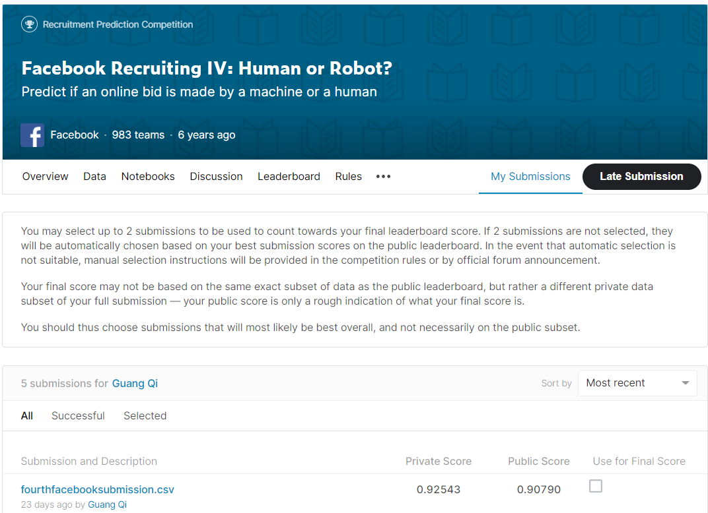

# facebook-recruiting-iv-human-or-bot

# Introduction
In this Jupyter notebook, I present my approach to the recent Kaggle competition, [Facebook Recruiting IV: Human or Robot?](https://www.kaggle.com/c/facebook-recruiting-iv-human-or-bot). 

# Problem
For this competition, we will be chasing down robots for an online auction site. Human bidders on the site are becoming increasingly frustrated with their inability to win auctions vs their software-controlled counterparts. Goal of this competition is to identify online auction bids that are placed by bots, helping the site owners to easily flag these users for removal from their site to prevent unfair auction activity.

# Attempt

**Analyzing more than 7 million bids to come up with various features such as :**  

Num of bids 
statistics of time difference for bids of each bidder 
entropy level of each bidder 
standard statistics of characteristics of each bidder (IPs, Devices, Countries, URLs) 
Number of 'first' and 'last' bids done for an auction for each bidder 

Utilising Bagging and Boosting of 4 different models ( RandomForest, XGBoost, CatBoost and Gradient Boosting) 

**Training accuracy** : 94.125%  
**Average Training AUC (on Training Dataset) ** : 0.939  

# Results 

My team and I managed to score a total of 0.92543 on the Kaggle Global Private Leaderboard. ( Top 160 )
